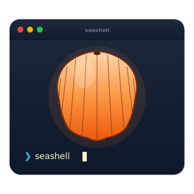

<div align="center">



# SeaShell

**An MCP server that brings Claude into Wave Terminal.**

Bridges Claude Desktop and [Wave Terminal](https://github.com/wavetermdev/waveterm) so Claude can run commands, manage your Wave configuration, control terminal blocks, and (optionally) chain in a local LLM for natural-language shell.

[Install](#install) · [Features](#features) · [Customize via AI](#customize-via-ai) · [Architecture](docs/ARCHITECTURE.md) · [License](#license)

</div>

---

## What it is

Seashell is a [Model Context Protocol](https://modelcontextprotocol.io) (MCP) server, written in Swift, that runs alongside Claude Desktop on macOS. It registers a set of tools that Claude can call to:

- Execute shell commands (silent or visible in Wave blocks)
- Read and write Wave Terminal's JSON configs (settings, widgets, AI presets, backgrounds)
- Create, delete, and query Wave blocks via an in-Wave helper
- Manage Wave secrets, themes, fish widget definitions, and workspace bootstrapping
- Capture and diff your shell environment, manage templates and pipelines

A small companion fish/Ollama stack is bundled as an optional starter — local LLM command prediction, fuzzy directory navigation, auto theme switching — but Seashell itself doesn't require any of it.

## Demo

> Recordings will land here once the public release is stable. For now, see the descriptions in [Features](#features).

## Install

### Prerequisites

- macOS 13 (Ventura) or newer
- [Wave Terminal](https://www.waveterm.dev/)
- [Claude Desktop](https://claude.ai/download)
- Swift 5.9+ (ships with Xcode Command Line Tools: `xcode-select --install`)

### Build

```bash
git clone https://github.com/M-Pineapple/seashell ~/Github/seashell
cd ~/Github/seashell
./build.sh
```

`build.sh` compiles a release binary at `.build/release/seashell` and creates a convenience symlink in the project root.

### Register with Claude Desktop

Edit `~/Library/Application Support/Claude/claude_desktop_config.json` and add:

```json
{
  "mcpServers": {
    "seashell": {
      "command": "/absolute/path/to/seashell/.build/release/seashell",
      "args": ["--port", "9876", "--verbose"]
    }
  }
}
```

A template is included at [config/claude-desktop-config.json](config/claude-desktop-config.json).

Restart Claude Desktop. The Seashell tools should now appear in the available-tools list when you start a conversation.

### (Optional) Add the example fish + Wave config

```bash
cd ~/Github/seashell/examples/wave-config
./install.sh
```

This installs a fully wired fish setup with auto-completion, Ollama-backed natural-language Enter, automatic light/dark theme switching, and Wave widget templates. See [`examples/wave-config/README.md`](examples/wave-config/README.md) for what it contains and how to customize it.

## Features

### Direct Wave config tools (no helper needed)

Read or modify `~/.config/waveterm/*.json` files directly. Wave watches its config files and reloads on change, so updates apply immediately.

- **`wave_get_settings`** / **`wave_set_setting`** — read and write `settings.json`
- **`wave_get_widgets`** / **`wave_create_widget`** / **`wave_update_widget`** / **`wave_delete_widget`** — manage the widget bar
- **`wave_get_ai_presets`** / **`wave_set_ai_preset`** — manage AI model presets
- **`wave_set_theme`** — change the terminal theme
- **`wave_set_appearance`** — font, transparency, cursor, gap size
- **`wave_get_backgrounds`** — list tab backgrounds

### Helper-block tools (require an in-Wave helper)

The bundled `helper/seashell-helper` script runs inside Wave Terminal as a small TCP-RPC proxy. Because it lives inside Wave, it has access to `WAVETERM_JWT` and can exercise the full `wsh` RPC surface.

- **`wave_list_workspaces`** / **`wave_list_blocks`** — query Wave's object model
- **`wave_create_block`** / **`wave_delete_block`** — programmatically create or remove terminal/preview/web blocks
- **`wave_get_scrollback`** — pull the last command's output (or the full block scrollback)
- **`wave_get_block_meta`** / **`wave_set_block_meta`** — read or update per-block metadata (theme, font, shell)
- **`wave_run_in_block`** — execute a command in a fresh Wave block
- **`wave_view_file`** / **`wave_edit_file`** — open files in preview or edit blocks

### Secrets and workspace tools

- **`wave_secret_list`** / **`wave_secret_set`** / **`wave_secret_get`** / **`wave_secret_delete`** — manage Wave's keychain-backed secrets (Tier C — explicit approval required)
- **`wave_set_background`** — set tab background image or color
- **`wave_create_fish_widget`** — convenience wrapper to spawn a fish-configured widget
- **`wave_bootstrap_workspace`** — apply a complete project workspace template

### Command execution

- **`execute_command`** — run a shell command, capture output. Pass `show_in_wave=true` to make it visible in a new Wave block.
- **`execute_with_auto_retrieve`** — runs and intelligently waits for output before returning
- **`execute_with_streaming`** — streams output in real time
- **`execute_pipeline`** — multi-step pipelines with conditional progression
- **`get_command_output`** / **`list_recent_commands`** — query the local SQLite history

### Templates, profiles, environment

- **`save_template`** / **`run_template`** / **`list_templates`** — save command sequences as named templates
- **`save_workspace_profile`** / **`load_workspace_profile`** — capture per-project shell environments
- **`get_environment_context`** — auto-detect the current project's runtime, git state, package files
- **`capture_environment`** / **`diff_environment`** — snapshot env vars and PATH

### Permission tiers

Every tool is classified into one of three risk tiers:

- **Tier A — safe**: read-only operations, log and proceed
- **Tier B — confirm**: writes that need a one-time confirmation per call
- **Tier C — approve**: secrets and shell dotfile edits — require explicit approval with a reason

See [`docs/ARCHITECTURE.md`](docs/ARCHITECTURE.md) for the full tier table.

## Customize via AI

The bundled [`examples/wave-config/`](examples/wave-config/) is **one** opinionated way to set up Wave + fish + Ollama. If you want a setup that fits *your* preferences, see [`prompts/`](prompts/) — copy-paste-ready prompts you can feed into Claude (or any AI assistant) to have it design the configuration around how you actually work.

| Prompt | What it gives you |
|---|---|
| [`install-from-scratch.md`](prompts/install-from-scratch.md) | End-to-end setup walkthrough on a fresh Mac |
| [`configure-wave-ui.md`](prompts/configure-wave-ui.md) | Fonts, theme, cursor, transparency tailored to your screen |
| [`configure-shell-stack.md`](prompts/configure-shell-stack.md) | fish vs zsh, Ollama model size, plugin selection |
| [`configure-widgets.md`](prompts/configure-widgets.md) | A widget bar designed around what you actually check daily |
| [`configure-workflow.md`](prompts/configure-workflow.md) | Big-picture: describe your work, get a complete config plan |

## Examples

| Path | What's inside |
|---|---|
| [`examples/wave-config/`](examples/wave-config/) | Opinionated fish + fastfetch + theme-sync starter, with installer |
| [`examples/test_client.py`](examples/test_client.py) | Reference Python client for the command-receiver TCP port |

## Architecture

- **[`docs/ARCHITECTURE.md`](docs/ARCHITECTURE.md)** — System overview, layers, MCP tool surface, Wave object model
- **[`docs/WAVE_INTEGRATION.md`](docs/WAVE_INTEGRATION.md)** — How Seashell talks to Wave: `wsh`, `WAVETERM_JWT`, RPC mechanism, config schemas
- **[`docs/HELPER_PROTOCOL.md`](docs/HELPER_PROTOCOL.md)** — Wire protocol between the external Seashell server and the in-Wave helper

## Project layout

```
seashell/
├── README.md                  ← you are here
├── LICENSE                    ← MIT
├── Package.swift              ← Swift package manifest
├── build.sh / clean.sh        ← build scripts
├── setup.sh                   ← post-clone bootstrap
│
├── Sources/
│   ├── Seashell/              ← MCP server, tool handlers, Wave adapter
│   └── ConfigManager/         ← standalone config-management binary
├── Tests/SeashellTests/       ← unit tests
│
├── helper/seashell-helper     ← in-Wave Python helper (TCP proxy to wsh)
├── config/                    ← Claude Desktop config template
├── docs/                      ← architecture + integration docs
├── examples/wave-config/      ← opinionated fish + Wave starter
└── prompts/                   ← AI-assisted configuration prompts
```

## Acknowledgments

- **[Wave Terminal](https://github.com/wavetermdev/waveterm)** — the terminal Seashell is built around. Open-source, block-based, deeply scriptable.
- **[Anthropic](https://www.anthropic.com/)** — for the [Model Context Protocol](https://modelcontextprotocol.io) and Claude Desktop.
- **[Ollama](https://ollama.com/)** + the **Qwen** team — for the local LLM that powers the optional natural-language fish layer.
- **[fish shell](https://fishshell.com/)**, **[atuin](https://atuin.sh/)**, **[starship](https://starship.rs/)**, **[zoxide](https://github.com/ajeetdsouza/zoxide)**, **[fastfetch](https://github.com/fastfetch-cli/fastfetch)** — the small tools that make the example config worth running.

## License

MIT — see [LICENSE](LICENSE).

Built with 🐚 by Pineapple 🍍
